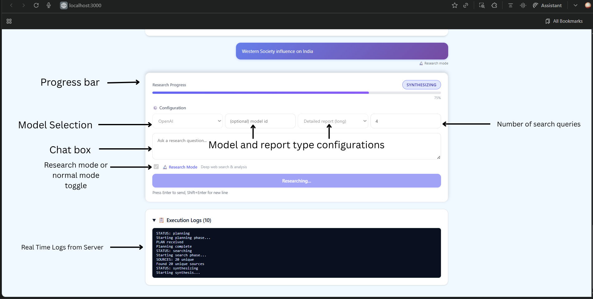

# Deep Research Agent

An intelligent research assistant powered by **LangGraph** that performs parallel web searches, evaluates multiple sources, and generates comprehensive reports with citations. Features dual-mode interaction (research vs chat), real-time streaming, and competitive search evaluation. A Project by Aryan Shah.

(P.S I have used my university GitHub Account because this is the account associated with the email I used to communicate with the team. Feel free to also checkout my personal projects at my [Personal GitHub](https://github.com/aryan1410) and my [Portfolio](https://www.aryanshah1410.com))

## Key Features

- **Model Selection**: Choose between OpenAI or Gemini LLMs (Defaults to OpenAI)
- **Dual Search Architecture**: Runs Tavily + SerpAPI in parallel, LLM selects best report
- **Chat + Research Modes**: Toggle between deep research and quick Q&A
- **Multiple Report Formats**: Bullet summaries, tables, or detailed academic reports
- **Real-Time Streaming**: Live progress updates via Server-Sent Events
- **Source Citations**: Every claim backed by verifiable references

## Quick Setup

### Prerequisites

- Python 3.11+ and Node.js 18+
- API Keys: [OpenAI](https://platform.openai.com/api-keys) + [Tavily](https://tavily.com) (required), [SerpAPI](https://serpapi.com) (optional) + [Gemini](https://www.google.com/aclk?sa=L&ai=DChsSEwiWnZbvx8GQAxVhJ0QIHWvoArIYACICCAEQABoCZHo&ae=2&co=1&ase=2&gclid=CjwKCAjwjffHBhBuEiwAKMb8pN7kTxPxi3EM-QBHHWEQaAFI-yKTcmr60MSdlMDZcnGpKYD5T_UXQhoC-0MQAvD_BwE&ei=L-v9aJvcGtLAkPIP2_Gp8Q0&cid=CAASlwHkaK9ycQqNyIDF76RK4HstumkfN4RjBSlmb9GbujOyu1se1xjmT1L5WMOI1omD9ZZkBLBZKV29hquWEu6J5mdeZsN1AbX39M_SED2ny0nZXpoKFgrHEdLey66XyVlFnlj8jiF398KGoo7EYGfB3D3ZDuWO7zNpROHapd2lpE8LrgNbfSllSOvMS8w0QkresIeWimsPIJd3&cce=2&category=acrcp_v1_71&sig=AOD64_3aFI6UHXFnMvX350wsXDCj5Ymzyw&q&sqi=2&nis=4&adurl&ved=2ahUKEwjbr5Lvx8GQAxVSIEQIHdt4Kt4Q0Qx6BAgMEAE) (optional)

### 1. Clone & Install

```bash
git clone https://github.com/aryanusc1410/deep-research.git
cd deep-research

# Backend
python -m venv research-agent
source research-agent/bin/activate  # Windows: research-agent\Scripts\activate
pip install -r requirements.txt

# Frontend (new terminal)
cd frontend
npm install
cd .. #Back to root
```

### 2. Configure Environment

**`backend/.env`:**

```env
OPENAI_API_KEY=sk-...
GEMINI_API_KEY=...        # Optional
TAVILY_API_KEY=tvly-...
SERP_API_KEY=...           # Optional
MODEL=gpt-4o-mini
MAX_MESSAGES=12
MAX_SEARCHES=12
USE_DUAL_SEARCH=true
GEMINI_MAX_OUTPUT_TOKENS=2048
GEMINI_TIMEOUT_SECONDS=30
GEMINI_REQUEST_TIMEOUT=45
GEMINI_MAX_RETRIES=1
GEMINI_MAX_SEARCHES=4
```

**`frontend/.env.local`:**

```env
NEXT_PUBLIC_BACKEND_URL=http://localhost:8000
```

### 3. Run Application

#### Option A: Using Docker

```bash
# From project root
docker build -f backend/Dockerfile -t deep-research-backend .
docker build -f frontend/Dockerfile -t deep-research-frontend .
docker-compose up
```

**Open:** http://localhost:3000

#### Option B: Manual (Two Terminals)

**Terminal 1 (Backend):**

```bash
cd backend
uvicorn app:app --reload
```

**Terminal 2 (Frontend):**

```bash
cd frontend
npm run dev
```

**Open:** http://localhost:3000

## Usage



1. **Research Mode** (toggle ON): Enter query → Get sourced report with citations
2. **Normal Mode** (toggle OFF): Ask follow-ups without triggering new research
3. **Detailed Reports**: Select "Detailed report (long)" for 1500+ word analysis
4. **Model Selection**: Select between OpenAI or Gemini LLMs (Gemini is limited in search power due to free tier API)
5. **Number of Query Searches**: Configure number of searches as per level of detail required

## Tech Stack

**Backend:** FastAPI, LangGraph, LangChain, OpenAI, Tavily/SerpAPI  
**Frontend:** Next.js, React, TypeScript, SSE streaming  
**Key Pattern:** Stateful workflows with parallel search + LLM evaluation

## What Makes It Different

1. **Competitive Evaluation**: Generates 2 complete reports from different engines, LLM picks winner
2. **Stateful Orchestration**: LangGraph manages explicit state transitions (not just prompt chaining)
3. **Hybrid Modes**: Seamlessly switch between research and chat without losing context
4. **Production SSE**: Proper streaming with backpressure handling and error recovery

## Structure

```
assets/
backend/     # FastAPI + LangGraph workflows
frontend/    # Next.js + React UI
├── app/     # Pages and routing
└── components/  # Report, Log components
```

## Common Issues

- **Port conflicts**: Kill processes on 8000/3000
- **Missing API keys**: Check `.env` files exist and have valid keys
- **CORS errors**: Verify `NEXT_PUBLIC_BACKEND_URL` matches backend
