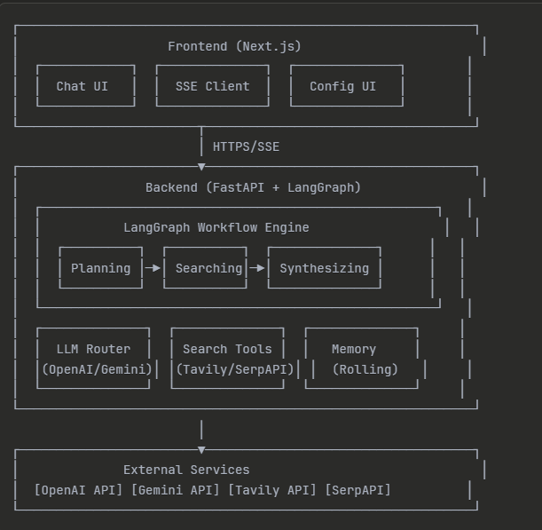

# Deep Research Agent - System Design Document

## 1. Overview

The Deep Research Agent is an AI-powered research assistant that searches the web, evaluates multiple sources, and generates reports with proper citations. It's built with FastAPI on the backend and Next.js on the frontend, using LangGraph to manage the research workflow with real-time progress updates.

The most impressive part is **competitive search evaluation**: the system runs two search engines (Tavily and SerpAPI) at the same time, generates a complete report from each one, and then asks the LLM to pick which report is better. This way you get the best of both search engines instead of relying on just one.

## 2. Architecture

### 2.1 System Components

The backend has a three-phase workflow managed by LangGraph. First is **Planning** - it takes your research question and breaks it into 3-12 specific search queries. Then **Searching** - it runs those queries across the search tools in parallel using ThreadPoolExecutor. Finally **Synthesizing** - it takes all the sources and generates a formatted report.

The frontend gives you two ways to interact. **Research mode** kicks off the full workflow and shows you real-time progress with Server-Sent Events. **Chat mode** skips the research and just gives you quick LLM responses, while still remembering your conversation history through a rolling memory buffer. You can switch between modes anytime in the same conversation.

### 2.2 Technology Stack

The backend uses FastAPI for handling requests asynchronously with Uvicorn as the server. LangGraph manages the workflow states, and LangChain connects to OpenAI and Google Gemini. Search happens through Tavily and SerpAPI via LangChain community tools. Pydantic validates everything and loads settings from environment variables.

The frontend is built with Next.js 14, React 18, and TypeScript for type safety. It parses Server-Sent Events natively for real-time updates. Custom CSS handles responsive design with mobile-first thinking and fixes for iOS Safari quirks.

## 3. Core Features

### 3.1 Workflow Execution

**Planning** sends your query to the LLM and asks it to break things down into specific searches. The number of queries adapts to the provider - OpenAI can handle 8-12 queries for detailed reports while Gemini sticks to 4-6 to save quota. If the LLM times out, the system just uses a simple three-query backup plan.

**Searching** runs your queries through the configured search tools. When dual search is on, Tavily and SerpAPI both run at the same time in separate threads, each grabbing up to 5 results per query. The results get merged by alternating between sources to keep things diverse. URLs that show up in both get deduplicated while keeping the first one found. If an individual query fails, it just logs the error and keeps going with the others.

**Synthesizing** builds a document with all the sources numbered [1], [2], [3] and sends it to the LLM with instructions for your chosen template. In dual search mode, it generates two complete reports at the same time in parallel threads, then asks the LLM to judge which one is better based on how comprehensive it is, source quality, and relevance. The winning report comes back with only the citations from that source.

### 3.2 Report Templates

**Bullet Summary** gives you an executive briefing with sections for TL;DR, Key Findings, Evidence, and Risks. It's around 200-500 words and works great for quick insights and decision-making.

**Claim/Evidence Table** makes a two-column markdown table - claims on the left, evidence with citations on the right. This format is perfect for fact-checking and comparisons. Gemini needs extra instructions to output just the table without adding explanations, so the system has a function to extract the table from longer responses.

**Detailed Report** follows an academic structure: Executive Summary, Introduction, Methodology, Key Findings (with 4-6 subsections), Discussion, Limitations, and Conclusion. It's around 1500-2500 words and shows up collapsed by default so it doesn't overwhelm you with text.

### 3.3 Provider Management

The system has smart fallback logic for LLM providers. OpenAI is the main provider and has no fallback since it's required for the system to work. Gemini is optional and automatically falls back to OpenAI if you don't have the API key. This means the system always works with minimal setup.

Gemini requests get wrapped in a timeout using ThreadPoolExecutor with a 30-second limit. When Gemini runs out of quota and hangs, the timeout kicks in and raises an LLMTimeoutError. Planning catches this and uses the simple backup plan. Synthesis returns a timeout message instead of crashing. OpenAI requests skip the timeout wrapper and run normally.

Provider-specific tweaks handle Gemini's limitations. It maxes out at 10 sources compared to unlimited for OpenAI. Search queries get reduced to save quota. Template instructions get extra formatting rules to keep output strict. The system tracks which provider actually got used and tells you in the response.

### 3.4 Search Tool Architecture

The tool factory pattern creates search instances with matching interfaces. Tavily is configured to include AI-generated answers and raw content. SerpAPI wraps Google search results and formats them to look like Tavily's output. Both tools handle errors by logging them and returning empty results instead of crashing.

Query execution tracks metadata for each result - which query found it and which tool it came from. This lets the synthesis phase filter things properly and shows you where sources came from. The deduplication function compares URLs and keeps the first one it sees, which preserves diversity when merging interleaved results from multiple sources.

### 3.5 Memory Management

The RollingBuffer class uses Python's deque with a fixed max length of 12 messages by default. When it's full, adding new messages automatically kicks out the oldest ones in FIFO order. This stops the context from growing forever while keeping recent conversation history.

Memory works with both research and chat modes. Research mode filters out messages marked as research results so it doesn't stuff full reports into the LLM context. Chat mode includes everything for continuity. The buffer converts to simple dictionaries for the LLM and survives when you switch modes.

### 3.6 Real-Time Streaming

Server-Sent Events handle one-way streaming from backend to frontend. The FastAPI endpoint yields formatted SSE messages with event names and JSON data. Async execution uses run_in_executor to offload blocking workflow operations to thread pools, keeping the event loop free for streaming.

The frontend parses SSE with buffer management to handle fragmented messages. The reader accumulates decoded bytes until it finds double newlines that mark complete event blocks. Each block gets parsed to pull out event names and data, which update the UI state. Error handling catches network failures and shows error events to users.

Progress tracking maps workflow phases to percentages: Planning hits 33%, Searching hits 66%, Synthesizing hits 90%, and done is 100%. The UI shows a gradient progress bar with animated badges for the current phase. After completion, there's a two-second delay before resetting for the next query.

## 4. User Experience

### 4.1 Interaction Modes

You toggle between **Research** and **Chat** modes with a checkbox. Research mode shows config options for picking your provider, overriding the model, choosing a template, and setting search budget. The interface checks that budget is between 1-10 queries with smart defaults per provider. Progress indicators show phase changes and percentage completion while running. Final reports render with formatted markdown including tables, headers, citations, and color-coded source badges.

Chat mode hides the research UI and gives you instant text responses. The system remembers conversation context from previous messages including research results. You can ask follow-up questions about generated reports without triggering new research. Response times are around 2-5 seconds compared to 30-60 seconds for full research.

### 4.2 Mobile Optimization

Responsive design has three breakpoints: full desktop width, tablet at 1024px, and mobile at 768px. Grid layouts collapse from four columns to two to one as screen width shrinks. Typography scales down with headings getting 25-40% smaller on mobile.

iOS-specific tweaks include 16px minimum font sizes to stop automatic zoom when you tap inputs. Touch targets meet the 44px minimum height guideline. The sticky input container accounts for the iPhone notch using safe-area-inset-bottom. Collapsible sections for config and logs save screen space on small devices.

### 4.3 Source Verification

Each report includes a numbered citations section listing all referenced sources. Citations show title, URL, snippet preview, and a badge for which search tool found it. Inline citation markers use superscript numbers that conceptually link to the sources list. URLs open in new tabs with noopener and noreferrer for security.

The dual search winner indicator shows up when competitive evaluation happens, telling you which search tool gave the better report. This transparency helps you understand result quality and lets you manually check source diversity.

## 5. Technical Implementation

### 5.1 Concurrency

ThreadPoolExecutor enables parallel operations at several workflow stages. During dual search, two workers run Tavily and SerpAPI queries at the same time, cutting total time by about 50%. During dual synthesis, two workers generate complete reports from different source sets, then LLM evaluation happens sequentially after.

Async/await patterns in SSE endpoints prevent blocking the event loop during long operations. The run_in_executor function offloads synchronous workflow steps to thread pools while keeping async context for streaming. This lets the system handle multiple user requests at once without exhausting workers.

### 5.2 Error Handling

Custom exception hierarchy extends from DeepResearchError base class through ConfigurationError, ProviderError, and SearchError subtypes. API key validation happens at startup and request time, raising APIKeyError with helpful messages that include sign-up URLs. Provider errors include LLMTimeoutError for quota exhaustion.

Graceful degradation works at multiple levels. Missing optional API keys trigger provider fallback. Individual search query failures don't block remaining queries. Timeout errors in Planning generate simple fallback plans. Timeout errors in Synthesis return informative messages instead of crashing. Error events stream to the frontend via SSE so users see what happened.

### 5.3 Configuration

Pydantic Settings loads environment variables with type validation and defaults. Required keys are OPENAI_API_KEY and TAVILY_API_KEY. Optional keys are GEMINI_API_KEY and SERP_API_KEY. Tuning parameters control model selection, memory size, search budget, and Gemini-specific constraints.

Feature flags enable dual search when both Tavily and SerpAPI keys exist. Provider availability checks happen at request time with automatic fallback. The health endpoint shows current config status for monitoring and debugging.

### 5.4 Logging

Custom logger has a force_flush parameter for thread-safe output in concurrent contexts. Component names prefix each message for traceability. Severity levels include info, warning, error, and success with matching console formatting.

The frontend collects logs from SSE events and shows them in a collapsible terminal-style view. This gives transparency into workflow execution and helps with debugging. Timestamps and component names help you match logs with UI state changes.

## 6. Scalability

Current deployment uses single-instance containers on Render with separate frontend and backend services. CORS config allows cross-origin requests between the two services.

Main bottlenecks are LLM API rate limits, search API quotas, and lack of result caching. ThreadPool concurrency handles vertical scaling within single instances but doesn't distribute load across machines. Future improvements could add Redis for caching and Celery for background job processing. Database integration would enable conversation persistence and analytics tracking.

Token optimization through rolling memory buffers limits context growth to 12 messages no matter how long the conversation gets. Source limiting for Gemini prevents exceeding its smaller context window. These techniques provide predictable API costs but sacrifice some conversation continuity and comprehensiveness.

## 7. Production Considerations

Environment-based config separates secrets from code. Deployment uses Dockerfile ARG injection for build-time variables and runtime environment variables for secrets. The .gitignore explicitly excludes .env files and API keys from version control.

CORS middleware restricts origins to localhost for development and specific production domains. In production deployments, tighter origin restrictions should apply. Input validation through Pydantic models prevents malformed requests. However, there's no rate limiting right now, leaving the system vulnerable to abuse. Adding per-IP or per-user quotas would improve production readiness.

Health checks show service status and feature availability for monitoring systems. The synchronous run_sync endpoint provides a debugging alternative to SSE streaming. Error boundaries catch exceptions at workflow stages and convert them to user-friendly messages. These patterns enable reliable operation but would benefit from structured logging, metrics collection, and alerting for production deployment.